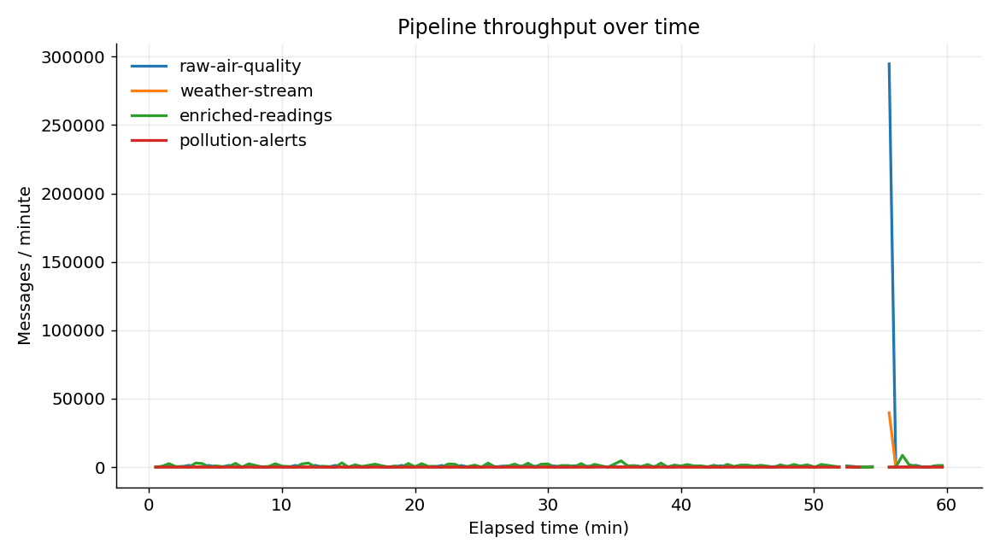
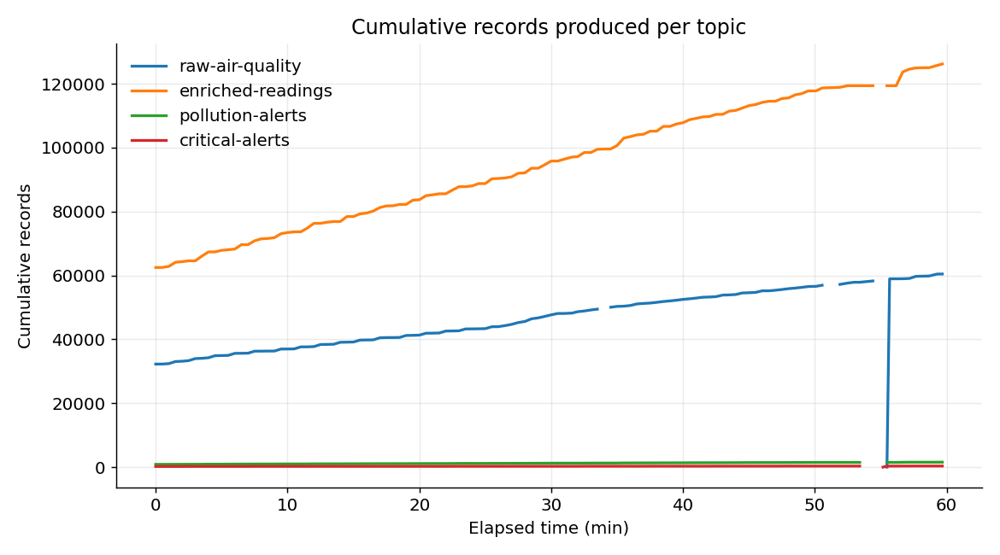
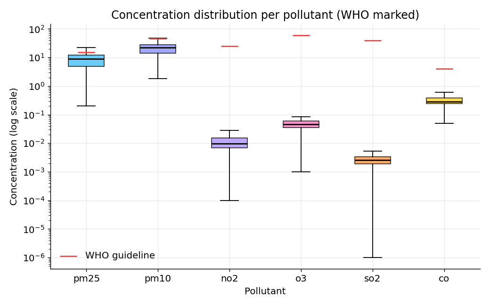
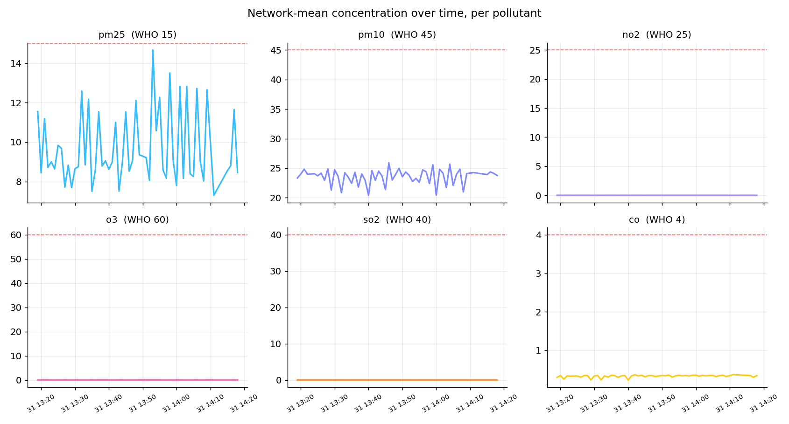
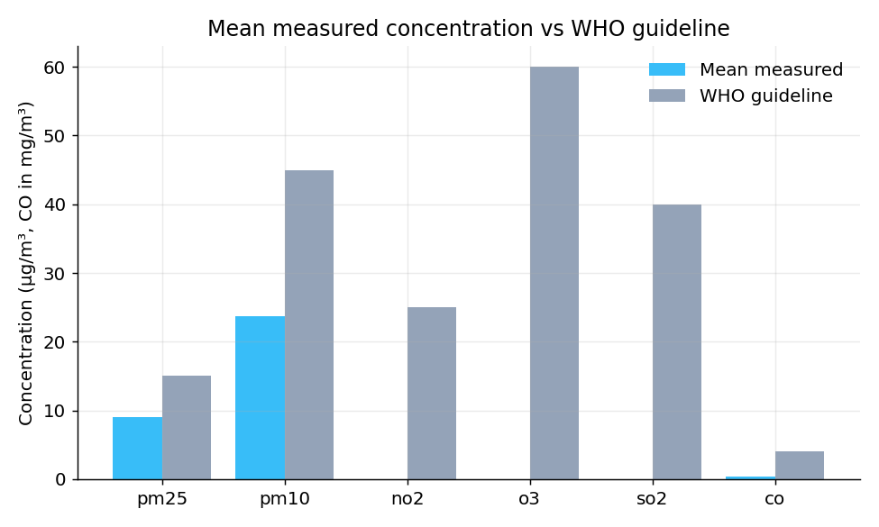
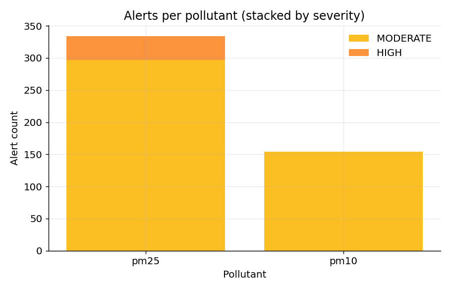
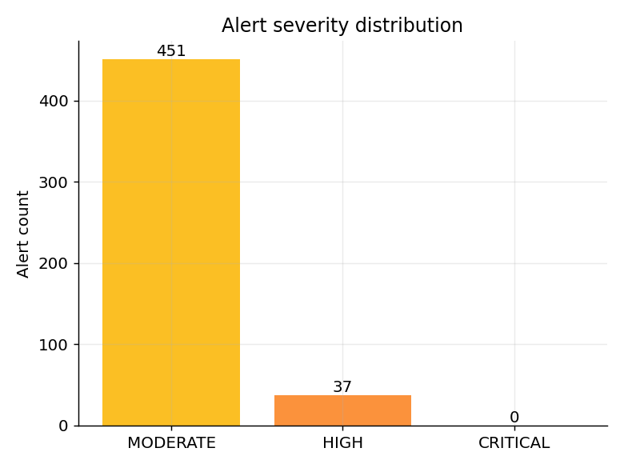
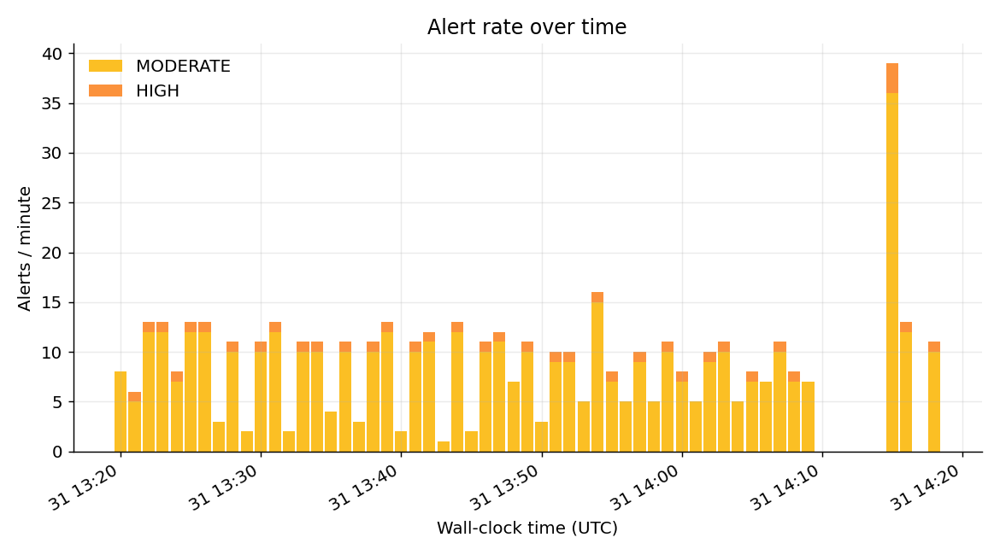
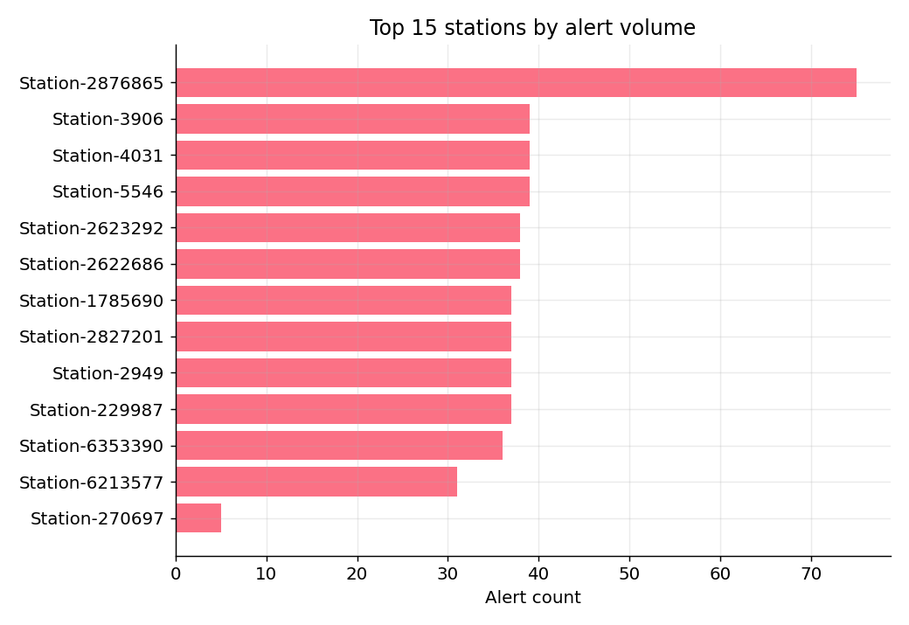
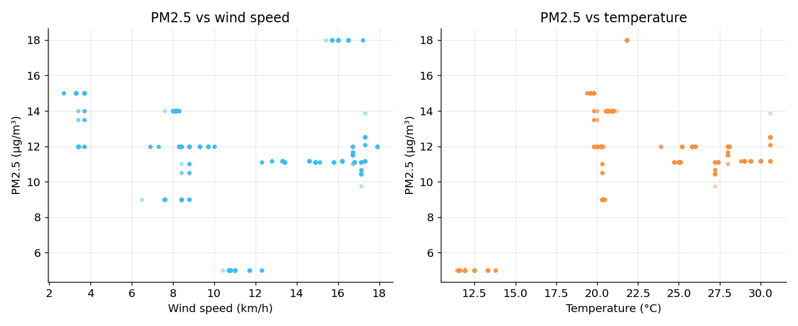

# AirQualityAnalyzer — real-time processing of air quality data

**Techniques for processing large-scale data**

Public repository: <https://github.com/dumibxd26/AirQualityAnalyzer>

## 1. About the project

The project builds a stream-processing pipeline for air quality data. It reads
measurements from public stations, combines them with weather data for the same
location, computes aggregates over time windows, raises alerts when
concentrations exceed the thresholds recommended by the WHO, and pushes the
results to a dashboard that updates as the data arrives.

The whole chain runs in Docker containers and uses three technologies that cover
the usual roles in a streaming data platform:

- **Apache Kafka** — the message bus that decouples the data sources from the
  compute engine. Each type of message has its own topic.
- **Apache Flink (PyFlink)** — the stream-processing engine that performs the
  windowed aggregations, the pollution-weather join, and the alert escalation.
- **FastAPI + WebSocket + frontend** — a bridge that takes the results from
  Kafka and pushes them to the browser, plus a dashboard written in JavaScript
  with a map (Leaflet) and charts (Chart.js).

Why this data lends itself to stream processing: the measurements arrive
continuously, in approximate order, from dozens of stations, and their
informational value is highest while they are fresh. A threshold-breach alert
makes sense to be raised within seconds, not at the end of the day after a batch
job.

## 2. Architecture

```
OpenAQ ──► producer.py ──┐
                         ├──► Kafka ──► Flink ──► Kafka ──► FastAPI ──► Browser
Open-Meteo ──► weather_producer.py ─┘   (topics)  (job)   (topics)   (WebSocket)
```

The data flow, step by step:

1. **`producer.py`** queries the OpenAQ v3 API for six pollutants and publishes
   each measurement to the `raw-air-quality` topic.
2. **`weather_producer.py`** listens to `raw-air-quality` to learn which
   stations exist (with latitude and longitude), then queries Open-Meteo for the
   current weather at each station and publishes to `weather-stream`.
3. **`flink_processor.py`** consumes both topics, computes one-minute window
   aggregates, enriches them with weather, detects threshold breaches, and writes
   to the `pollution-alerts`, `enriched-readings`, and `critical-alerts` topics.
4. **`backend/main.py`** consumes the output topics and forwards them over
   WebSocket to the dashboard; it also exposes `/health` and `/snapshot` for the
   current state.
5. **`frontend/`** shows the station map, the per-pollutant charts, and the
   alert list, updated in real time.

### 2.1 Kafka topics

The broker runs as a single node plus Zookeeper. Topics are created explicitly,
with partition counts chosen based on volume and the degree of parallelism wanted
in Flink:

| Topic | Partitions | Content |
|---|---|---|
| `raw-air-quality` | 12 | raw measurements from OpenAQ |
| `weather-stream` | 12 | current per-station weather from Open-Meteo |
| `enriched-readings` | 6 | per-minute aggregates + weather (for the dashboard) |
| `pollution-alerts` | 6 | per-window threshold breaches |
| `critical-alerts` | 3 | escalated episodes (repeated breaches) |

The broker has two listeners: an internal one (`kafka:29092`) for the Docker
services and an external one (`localhost:9092`) for host processes. The internal
`__transaction_state` topic is configured with replication factor 1 and minimum
ISR 1, a requirement for Flink's transactional writes to work on a single broker.

### 2.2 The Flink job

The job runs with one JobManager and two TaskManagers, default parallelism 4, and
a checkpoint every 30 seconds in `EXACTLY_ONCE` mode. It uses event time with a
60-second watermark tolerance for out-of-orderness. Because the 12 partitions of
each topic do not receive data uniformly, idle partitions are marked as such
after 10 seconds so the global watermark can still advance.

All outputs are produced by a single `StatementSet` with four sinks (pollution
alerts, enriched readings, critical alerts, and a print sink for the log).

## 3. How the data is collected

### 3.1 OpenAQ (air quality)

`producer.py` queries the OpenAQ v3 endpoint for six parameters:

| OpenAQ id | Parameter |
|---|---|
| 2 | pm25 |
| 1 | pm10 |
| 7 | no2 |
| 10 | o3 |
| 9 | so2 |
| 8 | co |

The poll interval is 15 seconds. A few design decisions are worth noting, because
they determine the quality of the data entering the pipeline:

- **De-duplication.** OpenAQ `/latest` returns the same value on every cycle
  until the station publishes a new one. The producer keeps the last
  `(location, parameter)` pair it saw and does not republish the same measurement
  until an interval (90 seconds) elapses, to keep the Flink windows fed without
  flooding the topic.
- **Dropping stale readings.** `/latest` can return values years old from
  defunct stations, which would otherwise corrupt the watermark. Readings older
  than six hours are discarded.
- **Rewriting the timestamp.** The Kafka message timestamp is set to ingest time
  so the event-time windows close promptly; the original event time is kept
  separately in `event_time`.
- **Filtering sentinel values.** OpenAQ uses special "no data" values (for
  example 9999, -999). These pass the thresholds and produce false alerts. The
  producer rejects the exact sentinels plus implausible per-pollutant upper
  bounds.

### 3.2 Open-Meteo (weather)

`weather_producer.py` does not query at random: it subscribes to
`raw-air-quality`, learns which stations exist and where they are, then queries
Open-Meteo for the current weather (temperature, wind speed and direction,
humidity, precipitation) at each station, every 60 seconds. The result is
published to `weather-stream`. This second stream exists to make the
pollution-weather join in Flink possible.

## 4. How alerts are defined

All alerting logic lives in the Flink job and has three levels.

### 4.1 Window aggregation

The pollution source is aggregated over a one-minute *tumbling* window, grouped by
`(location, parameter)`, producing the average of the values and the sample count
in the window. Only non-null, non-negative values enter the average.

### 4.2 Threshold breach

Each window's average is compared with a pollutant-specific threshold, inspired by
the WHO recommendations:

| Parameter | Threshold |
|---|---|
| pm25 | 15 |
| pm10 | 45 |
| no2 | 25 |
| o3 | 60 |
| so2 | 40 |
| co | 4 |

When the average exceeds the threshold, an alert is emitted to
`pollution-alerts`, classified by severity:

- **MODERATE** — above the threshold;
- **HIGH** — above twice the threshold;
- **CRITICAL** — above three times the threshold.

### 4.3 Critical escalation

Isolated breaches are not necessarily relevant. To catch sustained episodes, the
alerts are grouped in a five-minute *tumbling* window by `(location, parameter)`;
if at least three consecutive breaches appear in a window, a single event is
emitted to `critical-alerts`, with the peak value and the breach count. The
non-overlapping window guarantees that one episode produces a single critical
event, not multiple copies.

### 4.4 Weather enrichment

In parallel, the per-minute aggregates are joined with the weather stream through
an interval join: each window receives the weather sample of the same station
that falls within a ±5-minute interval. The result lands in `enriched-readings`
and feeds the dashboard and the correlation analysis below.

## 5. Results

For the report, the pipeline ran continuously and we collected the data for one
hour (31 May 2026, 13:19–14:19 UTC) directly from the Kafka topics. The volume
processed in this interval:

| Topic | New records in the hour |
|---|---|
| `raw-air-quality` | ~28,200 |
| `enriched-readings` | ~63,700 |
| `pollution-alerts` | 682 |
| `critical-alerts` | 140 |

From the output stream we captured 62,908 enriched windows, 488 pollution alerts,
and 101 critical events. The severity distribution of the alerts was 451 MODERATE
and 37 HIGH; no window reached the CRITICAL threshold (above three times the
limit), which is consistent with an atmosphere without extreme episodes during
that interval.

### 5.1 Throughput and cumulative volume

The number of messages grew steadily across all topics over the hour, without
stalls, which confirms that the pipeline stayed stable.





### 5.2 Per-pollutant statistics

The table below summarizes the 62,908 enriched windows, per pollutant. For pm25
and pm10 the values are in µg/m³ and compare directly with the WHO threshold. For
no2, o3, so2, and co, the OpenAQ source reports in ppm, so the absolute
comparison with the threshold does not apply directly; each pollutant is analyzed
separately.

| Pollutant | Windows | Mean | Median | Max | P95 | % over threshold |
|---|---|---|---|---|---|---|
| pm25 | 5,240 | 8.99 | 8.98 | 36.60 | 18.00 | 13.0% |
| pm10 | 11,930 | 23.76 | 22.00 | 85.50 | 50.00 | 6.9% |
| no2 | 17,831 | 0.012 | 0.010 | 0.047 | 0.028 | 0% |
| o3 | 9,218 | 0.046 | 0.046 | 0.085 | 0.070 | 0% |
| so2 | 9,347 | 0.003 | 0.002 | 0.008 | 0.005 | 0% |
| co | 9,342 | 0.337 | 0.280 | 2.200 | 0.650 | 0% |

The main observation: among the pollutants measured in µg/m³, pm25 is the one
that exceeds the threshold most often — 13% of the windows, with a peak of 36.6
µg/m³, that is 2.4 times the WHO limit. pm10 exceeds in 6.9% of the windows, with
a peak of 85.5 µg/m³.

### 5.3 Concentration distribution

The boxplot shows the per-pollutant distribution (log scale, with the threshold
marked). The relatively close means and medians indicate distributions without
large skew, but with extreme values for pm25 and pm10.



### 5.4 Time evolution per pollutant



### 5.5 Mean concentration versus the WHO threshold



### 5.6 Alerts

The distribution of alerts per pollutant and per severity, plus their evolution
over time:







The stations with the most alerts:



### 5.7 Correlation with weather

Using the enriched windows, we computed the Pearson correlation between each
pollutant's concentration and three weather variables:

| Pollutant | Wind | Temperature | Humidity | n |
|---|---|---|---|---|
| pm25 | 0.095 | 0.370 | -0.215 | 2,037 |
| pm10 | 0.131 | 0.525 | 0.502 | 10,731 |
| no2 | -0.118 | 0.026 | 0.244 | 15,538 |
| o3 | -0.263 | 0.022 | 0.020 | 4,398 |
| so2 | -0.558 | -0.384 | 0.100 | 5,295 |
| co | -0.502 | -0.413 | -0.156 | 4,497 |

A few relationships stand out from the data: so2 and co decrease as the wind
rises (correlation -0.56 and -0.50 respectively), which is consistent with wind
dispersing the pollutants. pm10 rises with temperature and humidity (0.53 and
0.50).



## 6. Processing guarantees

The pipeline is configured for end-to-end exactly-once delivery: checkpointing
enabled at 30 seconds, plus transactional Kafka sinks, with a distinct
transaction-id prefix per sink so the parallel sub-tasks do not collide. The job
ran over the hour with 28 tasks, without restarts.

## 7. Running the project

The whole stack starts with Docker Compose:

```bash
docker compose up -d
```

This brings up Zookeeper, the Kafka broker, the topic-initialization job, the
Flink cluster (JobManager + 2 TaskManagers), the two producers, the FastAPI
backend, and the frontend. The dashboard is available at `http://localhost:8080`,
and the Flink web UI at `http://localhost:8081`.

The statistics collection script and the figure generation script are in the
`report/` directory and connect to the external Kafka listener
(`localhost:9092`).

## 8. Code structure

| File | Role |
|---|---|
| `producer.py` | OpenAQ → `raw-air-quality` |
| `weather_producer.py` | Open-Meteo → `weather-stream` |
| `flink_processor.py` | aggregation, join, alerts |
| `backend/main.py` | Kafka → WebSocket + REST bridge |
| `frontend/` | dashboard (map, charts, alerts) |
| `docker-compose.yml` | orchestration |
| `report/collect_stats.py` | statistics collection from Kafka |
| `report/make_plots.py` | figure generation |

The complete source code is available in the public repository:
<https://github.com/dumibxd26/AirQualityAnalyzer>
